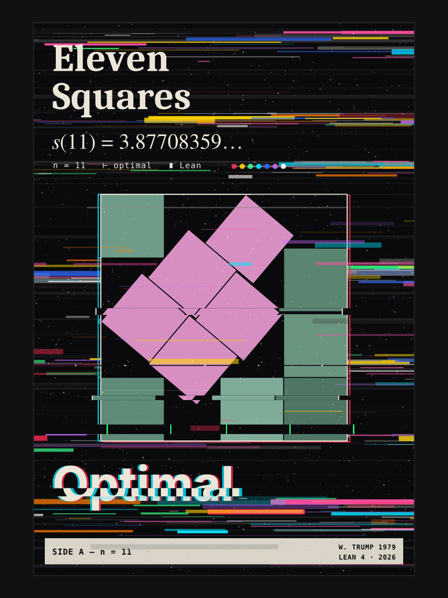
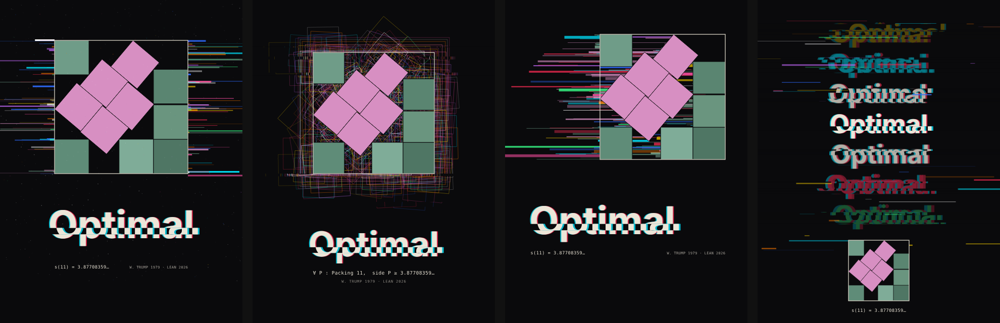

# s(11) — eleven squares, optimal

A t-shirt design for Walter Trump's 1979 packing of 11 unit squares in a square
of side **s(11) = 3.87708359…**, whose optimality has now been formalized in
Lean. Art direction is a corrupted cassette J-card: tape-tracking slices,
RGB channel split and colour streaks over the packing.



## Round 2 concepts

Clean packing; the glitch lives in the space and type around it.
`python3 scripts/concepts.py [seed]` writes `design/concepts/`.



| concept | idea |
| --- | --- |
| `a-signal` | the packing is the clean signal; noise leaks out sideways along its edges |
| `b-search` | glitchy ghosts of rejected arrangements behind the one that won |
| `c-smear` | pixel-sort smear: each square drags its colour off to the left |
| `d-stack` | "Optimal" degrading line by line like worn tape; packing as a small seal |

Each SVG has a full-bleed `#shirt` background rect for previewing; delete it
when printing on a black garment.

## Round 1 files

| file | what |
| --- | --- |
| `design/eleven-squares.svg` | print master, 12 × 16 in artboard, all text outlined (no fonts needed) |
| `design/eleven-squares-3600x4800.png` | 300 dpi raster of the same, transparent outside the card |
| `design/variants/` | other glitch seeds (7, 42, and a heavier 3) |
| `design/packing.json` | square vertices used for the art |

## Rebuilding

```sh
pip install numpy scipy fonttools
python3 scripts/solve_packing.py      # optional: regenerates design/packing.json (~3 min)
python3 scripts/make_design.py [seed] # writes design/eleven-squares.svg
NODE_PATH=$(npm root -g) node scripts/render.cjs design/eleven-squares.svg out.png 3
```

The geometry is a numerical reconstruction: coordinates measured off the
published figure, then relaxed with a separating-axis overlap penalty at the
known side length. Residual overlap is < 3·10⁻⁸ of a side, and the five
tilted squares converge to a common angle of 40.18°.

Fonts (outlined into the SVG): Caladea, FreeSerif, Inter, DejaVu Sans Mono — all
under open licences.
